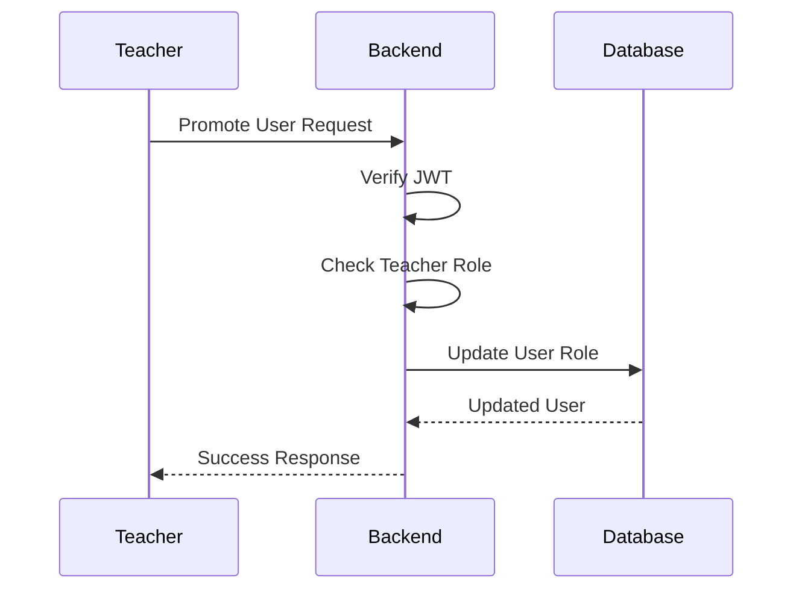

# User Management API Documentation

## Overview

The User Management API handles user administration inside Telegram LMS.

Teachers have special permissions to:

- View all users
- View students
- Promote students to teachers

Students cannot access these management features.

---

# Base URL

```text
http://localhost:5000
```

---

# User Roles

The system uses role-based access control.

```text
Student

- Access learning materials
- Read PDF files


Teacher

- Manage PDF files
- View users
- Promote students
```

---

# Authentication

All user management endpoints require:

```http
Cookie: token
```

Only teachers can access these routes.

---

# Get All Users

## Endpoint

```http
GET /users
```

## Description

Returns all registered users in the system.

---

## Permission

Required role:

```text
Teacher
```

---

## Success Response

Status:

```http
200 OK
```

Response:

```json
{
  "success": true,
  "count": 3,
  "users": [
    {
      "_id": "65abc123",
      "telegramId": 123456789,
      "username": "student1",
      "firstName": "John",
      "role": "student",
      "isMember": true
    },
    {
      "_id": "65abc456",
      "telegramId": 987654321,
      "username": "teacher1",
      "firstName": "Amanuel",
      "role": "teacher",
      "isMember": true
    }
  ]
}
```

---

# Get Students

## Endpoint

```http
GET /users/students
```

## Description

Returns only users with the student role.

---

## Permission

Required role:

```text
Teacher
```

---

## Success Response

```json
{
  "success": true,
  "count": 2,
  "users": [
    {
      "_id": "65abc123",
      "username": "student1",
      "role": "student"
    }
  ]
}
```

---

# Promote Student

## Endpoint

```http
PATCH /users/:id/promote
```

## Description

Changes a student's role to teacher.

This action can only be performed by an existing teacher.

---

## Example Request

```http
PATCH /users/65abc123/promote
```

---

## Permission

Required role:

```text
Teacher
```

---

## Success Response

```json
{
  "success": true,
  "message": "User promoted successfully",
  "user": {
    "_id": "65abc123",
    "role": "teacher"
  }
}
```

---

# Promotion Flow



---

# Authorization Flow

```text
Request

↓

Authentication Middleware

↓

Find Current User

↓

Check User Role

↓

Teacher Permission Granted

↓

Execute Action
```

---

# Error Responses

## Authentication Required

Status:

```http
401 Unauthorized
```

Response:

```json
{
  "success": false,
  "message": "Not authenticated"
}
```

---

## Access Denied

Status:

```http
403 Forbidden
```

Response:

```json
{
  "success": false,
  "message": "Access denied. Teachers only."
}
```

---

## User Not Found

Status:

```http
404 Not Found
```

Response:

```json
{
  "success": false,
  "message": "User not found"
}
```

---

## Already Teacher

Status:

```http
400 Bad Request
```

Response:

```json
{
  "success": false,
  "message": "User is already a teacher"
}
```

---

# Security

The user management system uses:

- JWT authentication
- Protected routes
- Teacher-only middleware
- Role validation

---

# Future Improvements

Possible improvements:

- Remove teacher permissions
- User activity tracking
- Admin dashboard
- Better permission levels
- User search and filtering

---

# Summary

The User Management API provides teachers with controlled administrative features while keeping student permissions limited and secure.