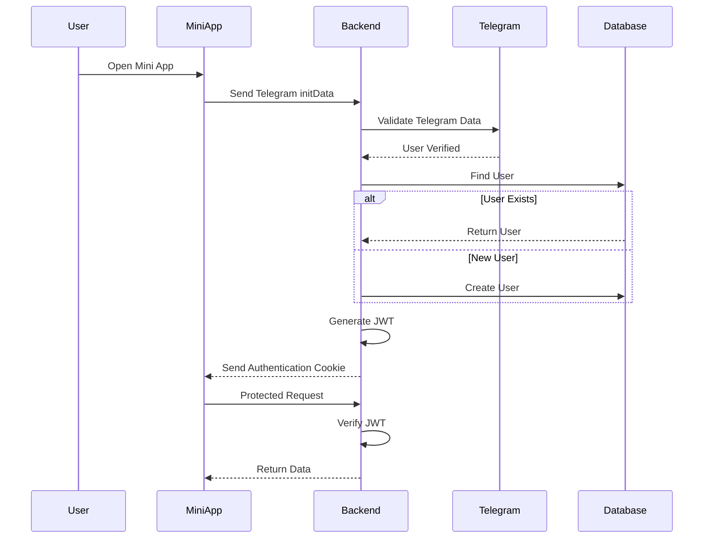

# Authentication Flow

## Overview

Telegram LMS uses Telegram authentication instead of traditional email and password authentication.

The user identity comes from Telegram, and the backend verifies the Telegram data before creating or logging in the user.

---

# Authentication Process

The authentication flow:

```text
User

↓

Open Telegram Mini App

↓

Telegram provides user information

↓

Frontend sends Telegram data to Backend

↓

Backend verifies Telegram signature

↓

Find existing user

↓

Create new user if needed

↓

Generate JWT Token

↓

Store token in HTTP-only Cookie

↓

User can access protected resources
```

---

# Authentication Architecture



---

# Authentication Components

## Telegram Authentication

Telegram provides:

- Telegram ID
- Username
- First name
- Last name
- Authentication data

The backend uses this information to identify users.

---

## User Creation

When a user logs in:

The backend checks:

```text
Does user exist?

YES
 |
 Load existing user


NO
 |
 Create new user
```

---

# JWT Authentication

After successful login:

The backend creates a JWT token.

The token contains:

```json
{
  "id": "user_database_id"
}
```

The token is stored inside:

```text
HTTP-only Cookie
```

---

# Protected Routes

Protected routes require authentication.

Example:

```text
GET /pdfs/my-files

PATCH /users/:id/promote
```

The request flow:

```text
Request

↓

Authentication Middleware

↓

Verify JWT

↓

Find User

↓

Attach User To Request

↓

Continue
```

---

# Authorization

After authentication, the system checks user roles.

Example:

```text
Student

Cannot:
- Upload PDF
- Delete PDF
- Promote users


Teacher

Can:
- Upload PDF
- Update PDF
- Delete PDF
- Manage users
```

---

# Security

Authentication security includes:

- Telegram verification
- JWT validation
- HTTP-only cookies
- Protected middleware
- Role-based access control

---

# Future Improvements

Possible improvements:

- Refresh token system
- Session management
- Two-factor authentication
- Better permission system

---

# Summary

The Telegram LMS authentication system provides a secure and simple login experience by using Telegram identity verification combined with JWT-based authorization.