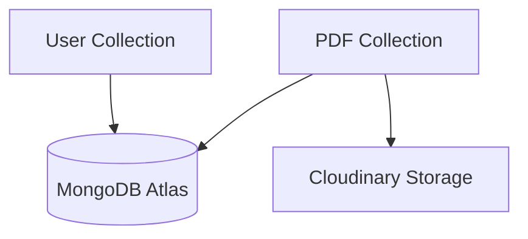
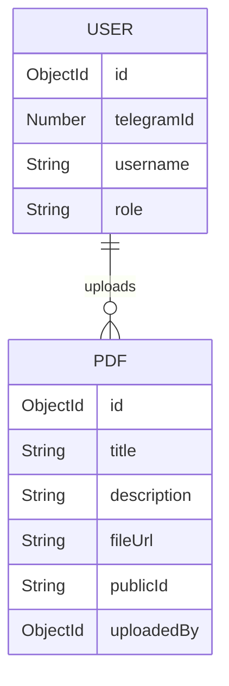

# Database Schema

## Overview

Telegram LMS uses MongoDB as the main database.

The database stores application information such as:

- Users
- User roles
- PDF metadata
- File references

The actual PDF files are stored in Cloudinary, while MongoDB stores information about those files.

---

# Database Architecture



---

# Collections

The application currently uses these collections:

```text
Database

│
├── users
│
└── pdfs
```

---

# User Collection

## Purpose

The User collection stores Telegram users and their permissions.

---

## User Schema

```javascript
{
  telegramId: Number,

  username: String,

  firstName: String,

  lastName: String,

  role: String,

  isMember: Boolean,

  createdAt: Date,

  updatedAt: Date
}
```

---

# User Fields

| Field | Type | Description |
|------|------|-------------|
| telegramId | Number | Telegram unique ID |
| username | String | Telegram username |
| firstName | String | User first name |
| lastName | String | User last name |
| role | String | Student or Teacher |
| isMember | Boolean | Group membership status |
| createdAt | Date | Account creation date |
| updatedAt | Date | Last update date |

---

# User Roles

The system uses role-based access.

```text
Student

- Read PDF files
- Access learning materials


Teacher

- Upload PDF files
- Update PDF files
- Delete PDF files
- Manage users
```

---

# PDF Collection

## Purpose

The PDF collection stores learning material information.

The collection does not store the actual file.

It stores the reference to Cloudinary.

---

## PDF Schema

```javascript
{
  title: String,

  description: String,

  originalName: String,

  publicId: String,

  fileUrl: String,

  fileSize: Number,

  uploadedBy: ObjectId,

  createdAt: Date,

  updatedAt: Date
}
```

---

# PDF Fields

| Field | Type | Description |
|------|------|-------------|
| title | String | PDF title |
| description | String | File description |
| originalName | String | Original uploaded name |
| publicId | String | Cloudinary identifier |
| fileUrl | String | PDF access URL |
| fileSize | Number | File size |
| uploadedBy | ObjectId | Teacher who uploaded |
| createdAt | Date | Upload date |
| updatedAt | Date | Last modification |

---

# Database Relationship

A teacher can upload multiple PDFs.

Relationship:



---

# Data Flow

When uploading a PDF:

```text
Teacher

↓

Upload PDF

↓

Cloudinary stores file

↓

Cloudinary returns URL

↓

Backend saves metadata

↓

MongoDB stores PDF record
```

---

# When Reading a PDF

The flow:

```text
Student

↓

Request PDF

↓

Backend gets PDF information

↓

MongoDB returns file URL

↓

Frontend opens PDF from Cloudinary
```

---

# Database Security

Security practices:

- Protected database connection
- User authorization
- Role validation
- No direct database access from frontend
- Environment variables for credentials

---

# Future Database Improvements

Possible improvements:

- Student progress collection
- Course collection
- Lesson collection
- Activity tracking
- Analytics collection

---

# Summary

The Telegram LMS database design is simple and focused on the MVP requirements.

MongoDB manages application data, while Cloudinary handles file storage, creating a clean and scalable structure.