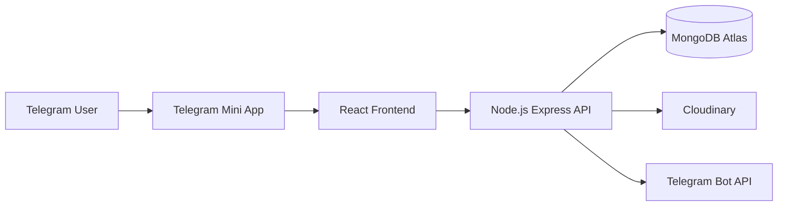
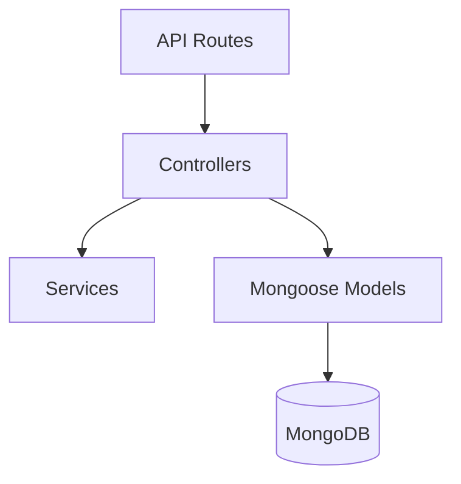
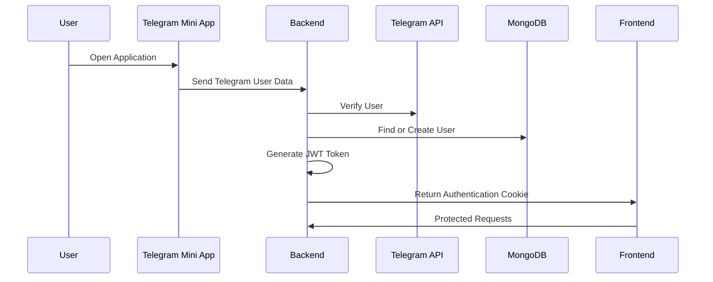

# System Architecture

## Overview

Telegram LMS follows a simple client-server architecture.

The system is divided into multiple components:

- Telegram Mini App (Frontend)
- Backend API
- Database
- Cloud File Storage
- Telegram Bot Service

Each component has a specific responsibility to keep the system clean and maintainable.

---

# High Level Architecture



---

# System Components

## Telegram Mini App

The Telegram Mini App is the user interface where students and teachers interact with the platform.

Responsibilities:

- Display learning materials
- Allow students to read PDF files
- Provide teacher management features
- Send Telegram user information to backend

Technology:

- React
- Tailwind CSS
- Telegram Mini Apps SDK

---

## Backend API

The backend is responsible for handling business logic and communication between services.

Responsibilities:

- Authenticate Telegram users
- Manage user roles
- Handle PDF operations
- Validate permissions
- Communicate with external services

Technology:

- Node.js
- Express.js
- Mongoose
- JWT Authentication

---

## Database

MongoDB stores application data.

The database stores:

- User information
- User roles
- PDF metadata
- File references

Example:

```text
User

_id
telegramId
username
firstName
role
isMember


PDF

_id
title
description
fileUrl
publicId
uploadedBy
```

MongoDB stores information about files but does not store the actual PDF files.

---

## Cloudinary Storage

Cloudinary is responsible for storing uploaded PDF files.

Responsibilities:

- Upload PDF files
- Generate file URLs
- Manage file storage
- Delete files when required

The database only stores:

- Cloudinary URL
- Public ID
- File details

---

## Telegram Bot Service

The Telegram Bot connects the system with Telegram groups.

Responsibilities:

- Announce new uploaded files
- Send notifications
- Provide links to open the Mini App

---

# Backend Architecture



---

# Request Flow

Every request follows this process:

```text
User

↓

Telegram Mini App

↓

Backend API

↓

Route

↓

Controller

↓

Service / Database

↓

Response

↓

Frontend
```

---

# Authentication Architecture

The authentication process:



---

# Authorization System

The system uses role-based access control.

Available roles:

```text
Student

- Read learning materials
- View available PDFs


Teacher

- Upload PDFs
- Update PDFs
- Delete PDFs
- Manage users
- Promote students
```

---

# Security Layers

The application uses multiple security layers:

## Authentication

- Telegram identity verification
- JWT authentication
- HTTP-only cookies

## Authorization

- Role checking middleware
- Teacher-only routes
- Protected API endpoints

---

# Design Principles

The project follows these principles:

- Simple and clean architecture
- Separation of responsibilities
- Reusable services
- Secure authentication flow
- Easy future expansion

---

# Future Improvements

Possible future improvements:

- Student progress tracking
- Learning analytics
- Notification queue system
- Advanced permission management
- Caching with Redis
- Microservice expansion

---

# Summary

Telegram LMS uses a lightweight but scalable architecture.

The system combines Telegram, React, Node.js, MongoDB, and Cloudinary to provide a simple learning platform where teachers manage resources and students access educational materials easily.