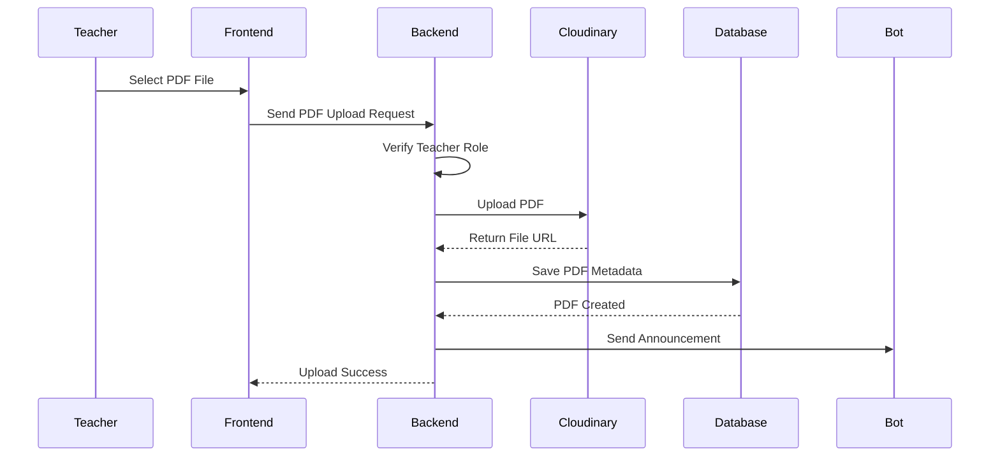

# PDF Upload Flow

## Overview

Telegram LMS allows teachers to upload learning materials as PDF files.

The upload system separates file storage and application data:

- Cloudinary stores the actual PDF file.
- MongoDB stores PDF information and metadata.

This keeps the application faster and easier to manage.

---

# Upload Process

The upload flow:

```text
Teacher

↓

Open Teacher Dashboard

↓

Select PDF File

↓

Send Upload Request

↓

Backend Validates User Role

↓

Upload File To Cloudinary

↓

Save PDF Information In MongoDB

↓

Send Success Response

↓

Announce File Using Telegram Bot
```

---

# Upload Architecture



---

# Upload Components

## Frontend

The frontend provides:

- File selection
- Upload form
- Upload progress
- Success/error messages

The frontend sends:

```text
PDF File

Title

Description
```

to the backend.

---

## Backend

The backend handles:

- Authentication
- Authorization
- File validation
- Cloudinary upload
- Database storage

The backend checks:

```text
Is user authenticated?

YES
 |
Continue


NO
 |
Reject request
```

---

# Teacher Authorization

Only teachers can upload files.

Flow:

```text
Request

↓

JWT Middleware

↓

Check User

↓

Teacher Middleware

↓

Upload Permission Granted

↓

Continue
```

---

# Cloudinary Storage

Cloudinary stores the PDF file.

Example:

```text
Cloudinary

telegram-lms/

   pdfs/

      lesson-1.pdf
      lesson-2.pdf
```

Cloudinary returns:

```json
{
  "publicId": "telegram-lms/pdfs/file.pdf",
  "url": "https://cloudinary.com/file.pdf"
}
```

---

# Database Storage

MongoDB stores the PDF details.

Example:

```json
{
  "title": "Node.js Basics",
  "description": "Backend Introduction",
  "fileUrl": "cloudinary_url",
  "publicId": "cloudinary_file_id",
  "uploadedBy": "teacher_id"
}
```

---

# File Management Flow

After uploading, teachers can:

```text
PDF

├── View

├── Update Information

└── Delete
```

---

# Delete Flow

When deleting a PDF:

```text
Teacher

↓

Send Delete Request

↓

Backend Finds PDF

↓

Remove File From Cloudinary

↓

Remove Data From MongoDB

↓

Return Success Response
```

---

# Security Considerations

The upload system uses:

- Authentication middleware
- Teacher role checking
- File validation
- Secure Cloudinary storage
- Protected API routes

---

# Future Improvements

Possible improvements:

- Upload progress tracking
- Multiple file upload
- Video support
- File compression
- Background processing

---

# Summary

The PDF upload system provides a simple and secure way for teachers to manage learning materials while keeping file storage separated from application data.