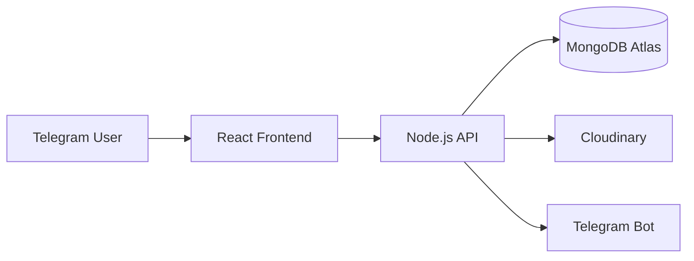

# Production Deployment Guide

## Overview

This guide explains how to deploy Telegram LMS for production use.

The application requires deployment of:

- Frontend
- Backend
- Database
- Cloud Storage
- Telegram Bot

---

# Production Architecture



---

# Database Deployment

Telegram LMS uses MongoDB Atlas.

Steps:

1. Create MongoDB Atlas cluster.
2. Create database user.
3. Allow server IP access.
4. Copy connection string.
5. Add it to environment variables.

Example:

```env
MONGO_URI=mongodb_connection_string
```

---

# Backend Deployment

The backend requires:

- Node.js environment
- Environment variables
- Database connection
- Cloudinary configuration

Production variables:

```env
PORT=5000

MONGO_URI=

JWT_SECRET=

BOT_TOKEN=

GROUP_ID=

CLOUDINARY_CLOUD_NAME=

CLOUDINARY_API_KEY=

CLOUDINARY_API_SECRET=
```

---

# Frontend Deployment

Frontend can be deployed using:

- Vercel
- Netlify
- Other hosting platforms

Required variable:

```env
VITE_API_URL=https://api.example.com
```

---

# Security Checklist

Before production:

## Backend

- Use HTTPS
- Protect environment variables
- Enable secure cookies
- Validate user input


## Database

- Restrict access
- Use strong password
- Enable backups


## Telegram

- Protect bot token
- Verify webhook security

---

# Deployment Flow

```text
Developer

↓

Push Code

↓

CI/CD Deployment

↓

Frontend Build

↓

Backend Start

↓

Database Connection

↓

Production Ready
```

---

# Monitoring

Recommended monitoring:

- Server logs
- Database status
- API errors
- Cloudinary usage
- Bot status

---

# Future Improvements

Possible improvements:

- Docker deployment
- CI/CD pipeline
- Automatic backups
- Monitoring dashboard
- Load balancing

---

# Summary

Production deployment separates frontend, backend, and storage services while keeping the system secure and scalable.